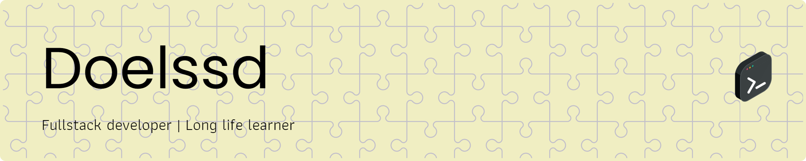

## 👋 Hi, I’m Abd Khalik Al-Fath Salsada  
💻 Mathematics graduate turned Full-Stack Developer  
💼 Dreaming in code, executing with precision  
🌱 Always learning, always building  
🧭 From numbers to networks — one line of code at a time  

<!--
**Doelssd/Doelssd** is a ✨ _special_ ✨ repository because its `README.md` (this file) appears on your GitHub profile.

Here are some ideas to get you started:

- 🔭 I’m currently working on ...
- 🌱 I’m currently learning ...
- 👯 I’m looking to collaborate on ...
- 🤔 I’m looking for help with ...
- 💬 Ask me about ...
- 📫 How to reach me: ...
- 😄 Pronouns: ...
- ⚡ Fun fact: ...
-->
Pronouns: Agam, Doel, Alik

## 🌐 Socials:
  

# 💻 Tech Stack:
      , , 
# 📊 GitHub Stats:
 
 
 

### ✍️ Random Dev Quote

### 🔝 Top Contributed Repo

---

<!-- Proudly created with GPRM ( https://gprm.itsvg.in ) -->
